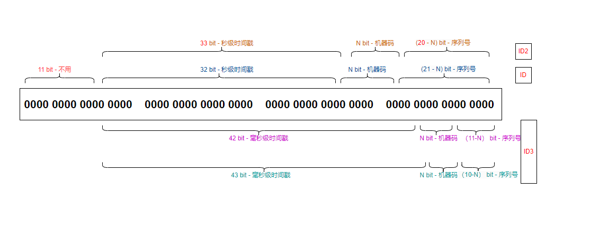

# go-id

id generator, which generates globally unique id

# 特性

1. 支持秒级、毫秒级ID生成
2. ID递增、不重复
3. 支持分布式（配置节点）ID生成
4. 采用53位整型，支持json整型传输解析，不会超限导致解析错误
5. 采用无锁技术，生成速度极快，每秒可生成两百多万不重复且递增的ID（受53位长度限制）
6. 每（毫）秒生成超限会等待直至下一（毫）秒，计数器会重置从 1 开始重新计数
7. 服务器时钟回拨也不会生成重复ID
8. 使用简单（单机使用无需任何配置，分布式使用，设置节点即可）

# 采用三段设计：

第一段长度 32 ~ 43 位，存放（毫）秒级时间戳 <br>
第二段长度 0 ~ 20 位，存放机器码 <br>
第三段长度 2 ~ 21 位，存放计数器（递增）




| 名称  | 方案                      | 最大支持时间              | 极限速度（N=0）     | 说明                        |
|-----|-------------------------|---------------------|---------------|---------------------------|
| ID  | Second 32+N+(21-N)      | 2106-02-07 14:28:15 | 2,097,152 / s | N = 0 OR (N >1 AND N <20) |
| ID2 | Second 33+N+(20-N)      | 2242-03-16 20:56:31 | 1,048,576 / s | N = 0 OR (N >1 AND N <19) |
| ID3 | Millisecond 42+N+(11-N) | 2109-05-15 15:35:11 | 2,048 / ms    | N = 0 OR (N >1 AND N <10) |
| ID3 | Millisecond 43+N+(10-N) | 2248-09-26 23:10:22 | 1,024 / ms    | N = 0 OR (N >1 AND N <9)  |

> N 表示节点占用位长度，可为 0 （适合单机使用）


# 使用
```shell
go get github.com/ace-zhaoy/go-id
```

#### 快速使用
```go
id := goid.GenID()
id2 := goid.GenID2()
id3 := goid.GenID3()
```
#### 设置节点（分布式）
```go
// 节点长度为 10（支持 1023 台机器），当前节点标识是1
goid.GetID().SetNode(1, 10)
```
> 节点越多，每个节点每秒生成的ID数量就越低，所以根据预期节点按需设置

#### 设置序列号起始值以及间隔值
```go
// id末尾的序列号间隔 1024
goid.GetID().SetDelta(1024)
```

#### 设置随机增量
```go
// id末尾的序列号每次在 1 ~ 1024 之间随机增加
goid.GetID().SetRandomDelta(1024)
```
> 在机器不多的情况下，可以设置随机增量来避免多机器ID重复

#### 不使用包自带的全局变量
```go
// 保存好变量
myID := goid.NewID()
id := myID.Generate()
```